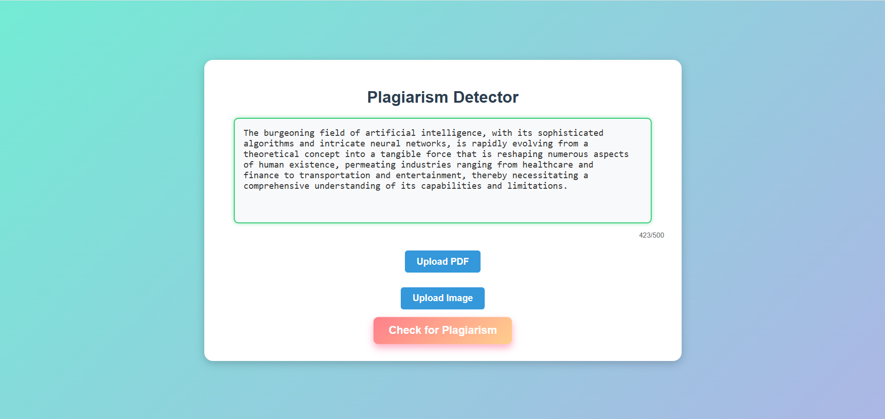
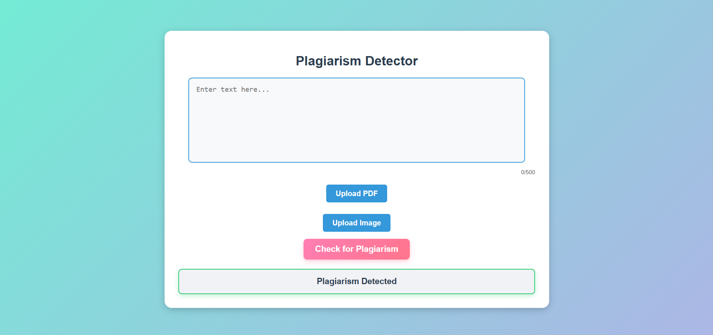

# 📄 Plagiarism Detector

A machine learning web application that detects plagiarism in text using Natural Language Processing (NLP). Built using Python, Flask, and scikit-learn, this app allows users to input text and receive an evaluation of potential plagiarism against a dataset.

---

## 🚀 Features

- 📚 Compares input text against a dataset to detect similarities  
- 🔤 Uses TF-IDF vectorization for text preprocessing  
- 🤖 Powered by a trained **Support Vector Machine (SVM)** model  
- 🧠 Pre-trained model and vectorizer (`model.pkl`, `tfidf_vectorizer.pkl`)  
- 🌐 Simple and clean web interface using Flask

---

## 🌐 Live Demo

👉 [Click here to view the deployed app](https://your-app-name.herokuapp.com/)  
> *(Replace the above link with your actual Heroku/Render/any other deployment URL)*

---

## 🖼️ Screenshots

---

## 🛠️ Tech Stack

- **Python**  
- **Flask**  
- **scikit-learn (SVM Classifier)**  
- **HTML/CSS (Jinja2 templates)**  
- **Pandas, NumPy**

---

## 🗂️ Project Structure

- Project is deployed at [https://plagiarism-detector-kn5a.onrender.com/](https://plagiarism-detector-kn5a.onrender.com/)
